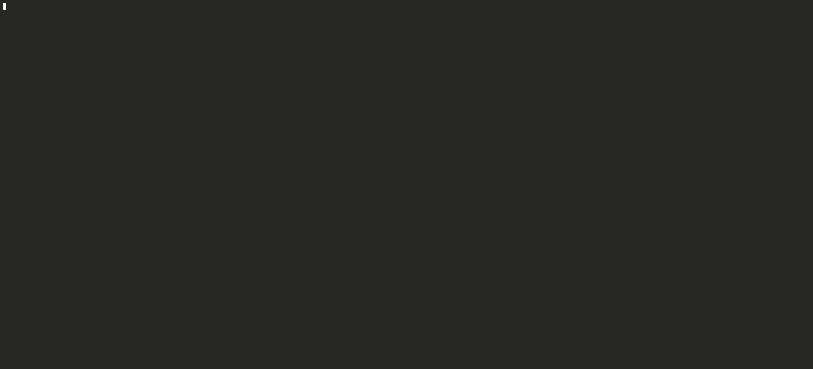

# Lets test our golang installation

When watching the following video it's recommended to fast forward the build process.

[[Watch the asciicast](https://asciinema.org/a/dIQqt6ucRjY6HY8sgIXPzfZlA)]  (https://asciinema.org/a/dIQqt6ucRjY6HY8sgIXPzfZlA)

[](media/build_k8s_master_image.gif)


## [Install kind](https://github.com/kubernetes-sigs/kind#installation-and-usage)

```
cd $HOME
curl -Lo ./kind "https://kind.sigs.k8s.io/dl/v0.7.0/kind-$(uname)-amd64"
chmod +x ./kind
sudo mv ./kind /usr/local/bin/kind
```

## kind usage examples
```
# one node cluster
kind create cluster

# 1 control plane, 1 worker nodes
kind create cluster --config sessions/session_2/kind_configs/1cp_1worker.yaml

kubectl get pods -A

kind delete cluster
```

### Configure the below before the next step
https://kind.sigs.k8s.io/docs/user/quick-start/#settings-for-docker-desktop

## Build kubernetes with kind
```
kind build node-image
kind create cluster --image kindest/node:latest

# We have previously cloned kubernetes into ${GOPATH}/src/k8s.io/kubernetes
# so we can run:
kind build node-image --image=k8s_dev_local/node:master

# This will create k8s_dev_local/node:master docker image
# with the currently checked out master branch/commit
```


## [Install operator-skd-cli](https://github.com/operator-framework/operator-sdk/blob/master/doc/user/install-operator-sdk.md#install-the-operator-sdk-cli)

### Test go code generation

```
# Create an app-operator project that defines the App CR.
$ mkdir -p $HOME/projects/example-inc/
# Create a new app-operator project
$ cd $HOME/projects/example-inc/
$ operator-sdk new app-operator --repo github.com/example-inc/app-operator
$ cd app-operator

# Add a new API for the custom resource AppService
$ operator-sdk add api --api-version=app.example.com/v1alpha1 --kind=AppService

# Add a new controller that watches for AppService
$ operator-sdk add controller --api-version=app.example.com/v1alpha1 --kind=AppService
```

# Recommended extras
## Gimme golang version manager
https://github.com/travis-ci/gimme#installation--usage

## Gimme based Docker image for basic golang experiments
https://github.com/rflorenc/golang-gimme-centos

## json incremental digger (jid)
https://github.com/simeji/jid#simply-use-jid-command


# Alternatives
## Minikube
https://kubernetes.io/docs/tasks/tools/install-minikube/

## Install kind in $(go env GOPATH)/bin
```
GO111MODULE="on" go get sigs.k8s.io/kind@v0.7.0
```
